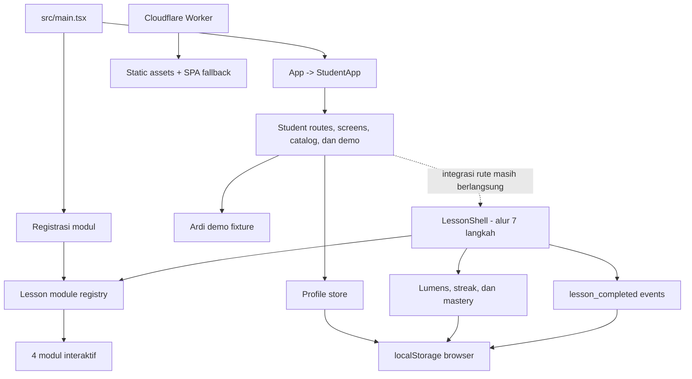

<p align="center">
  
</p>

<h1 align="center">Lumera</h1>

<p align="center">
  <strong>Belajar dengan mencoba, bukan menghafal.</strong>
</p>

<p align="center">
  Prototype akademi interaktif berbasis web untuk membantu pelajar Indonesia memahami konsep
  melalui simulasi, tantangan visual, umpan balik langsung, dan refleksi terpandu.
</p>

> [!IMPORTANT]
> Repositori ini masih berupa prototype frontend. Lumera belum memiliki autentikasi, backend,
> database, atau sinkronisasi lintas perangkat. Profil, progres, dan telemetry saat ini disimpan
> pada `localStorage` browser.

## Daftar isi

- [Tentang Lumera](#tentang-lumera)
- [Status implementasi](#status-implementasi)
- [Fitur yang tersedia](#fitur-yang-tersedia)
- [Teknologi](#teknologi)
- [Arsitektur](#arsitektur)
- [Prasyarat](#prasyarat)
- [Setup lokal](#setup-lokal)
- [Menjalankan aplikasi](#menjalankan-aplikasi)
- [Mode demo dan rute](#mode-demo-dan-rute)
- [Script npm](#script-npm)
- [Testing dan quality checks](#testing-dan-quality-checks)
- [Data dan penyimpanan lokal](#data-dan-penyimpanan-lokal)
- [Struktur proyek](#struktur-proyek)
- [Menambahkan modul pelajaran](#menambahkan-modul-pelajaran)
- [Build dan deployment](#build-dan-deployment)
- [Kontribusi](#kontribusi)
- [Batasan saat ini](#batasan-saat-ini)
- [Dokumentasi lanjutan](#dokumentasi-lanjutan)
- [Lisensi](#lisensi)

## Tentang Lumera

Lumera dirancang sebagai pengalaman belajar konseptual untuk pelajar Indonesia. Alih-alih hanya
menampilkan video atau bank soal, Lumera mengarahkan siswa untuk mencoba model visual, mengambil
keputusan, menerima umpan balik, memahami alasan di balik jawabannya, lalu melakukan refleksi.

Prototype pada repositori ini berfokus pada dua fondasi:

1. **Student experience Batch 1** — onboarding, beranda, katalog belajar, pencarian, progres,
   pengaturan, dan mode demo untuk siswa SMP kelas VII.
2. **Core lesson engine** — `LessonShell` bersama yang menegakkan alur tujuh langkah dan empat
   modul interaktif yang sudah terdaftar serta diuji.

Prinsip produk yang dijaga di dalam implementasi:

- setiap kontrol interaktif harus mengubah state secara nyata;
- alur tujuh langkah tidak boleh dilewati;
- kedalaman pelajaran lebih penting daripada banyaknya katalog;
- penjelasan "Kenapa?" tersedia untuk jawaban benar maupun salah;
- data demo harus ditandai sebagai ilustratif;
- konten dan telemetry harus dapat diverifikasi, bukan sekadar diklaim.

## Status implementasi

| Area                                  | Status           | Keterangan                                                                                   |
| ------------------------------------- | ---------------- | -------------------------------------------------------------------------------------------- |
| Onboarding siswa                      | Tersedia         | Profil lokal, tujuan belajar, mata pelajaran, ritme, dan rencana belajar                     |
| Student shell                         | Tersedia         | Navigasi hash, beranda, katalog, pencarian, progres, simpanan, dan pengaturan                |
| Katalog Batch 1                       | Sebagian         | Matematika SMP kelas VII tersedia; mata pelajaran dan kursus lain ditandai "Segera hadir"    |
| Mode demo Ardi                        | Tersedia         | Data progres, streak, simpanan, dan review yang secara eksplisit ditandai ilustratif         |
| Core lesson engine                    | Tersedia         | `LessonShell`, registry, progress engine, dan telemetry telah diuji                          |
| Empat modul interaktif                | Tersedia di core | Matematika, Fisika, Ekonomi, dan Sejarah                                                     |
| Integrasi modul ke student shell baru | Dalam proses     | Kartu modul pada student shell saat ini masih membuka ringkasan, belum seluruh lesson engine |
| Refresh/Simpanan/Progres nyata        | Sebagian         | Empty state tersedia; data penuh pada mode demo masih berupa fixture ilustratif              |
| Backend, akun, dan cloud sync         | Belum tersedia   | Seluruh data runtime masih lokal pada browser                                                |
| Deployment Cloudflare                 | Terkonfigurasi   | Worker, static assets binding, dan fallback SPA tersedia                                     |

Dokumen PRD menjelaskan visi Lumera yang lebih luas, termasuk Knowledge Bank dan Refresh Harian.
Keduanya belum boleh dianggap sebagai fitur produksi hanya karena sudah disebut di dokumentasi.

## Fitur yang tersedia

### Pengalaman siswa

- onboarding bertahap untuk siswa SMP kelas VII;
- beranda personal dengan kondisi pengguna baru dan mode demo;
- katalog mata pelajaran, jalur belajar, kursus, dan modul;
- tampilan roadmap serta daftar untuk kursus Bilangan Bulat;
- pencarian katalog dengan hasil yang belum tersedia tetap ditandai dan tidak dapat dibuka;
- halaman Ulangi, Simpanan, Progres, dan Pengaturan;
- preferensi pengurangan gerakan (`reduce motion`);
- reset onboarding tanpa menghapus data lesson engine;
- hash routing yang tetap bekerja pada static hosting/Worker.

### Fondasi aksesibilitas dan responsivitas

- navigasi desktop berubah menjadi bottom navigation pada viewport mobile;
- pencarian dapat dibuka melalui `Ctrl+K`/`Cmd+K` dan ditutup dengan `Escape`;
- tersedia focus indicator, semantic navigation, dialog/alert dialog, `aria-current`,
  `aria-live`, dan label tombol;
- animasi menghormati preferensi sistem serta toggle `reduce motion` pada profil.

Fondasi tersebut belum setara dengan klaim kepatuhan WCAG karena repositori belum menyertakan
hasil audit aksesibilitas menyeluruh.

### Core lesson engine

Setiap modul mengikuti urutan berikut:

1. Prompt
2. Model visual
3. Aksi pengguna
4. Umpan balik instan
5. Penjelasan "Kenapa?"
6. Refleksi
7. Lanjutkan

Empat modul yang tersedia pada layer core:

| Mata pelajaran | Modul                     | Bentuk interaksi utama                       |
| -------------- | ------------------------- | -------------------------------------------- |
| Matematika     | Membaca Kemiringan Grafik | Grafik dan input jawaban                     |
| Fisika         | Simulasi Gerak Lurus      | Kontrol variabel dan animasi gerak           |
| Ekonomi        | Supply & Demand           | Slider dan grafik keseimbangan               |
| Sejarah        | Rantai Sebab-Akibat       | Penyusunan urutan dengan alternatif non-drag |

Lesson engine juga menangani percobaan ulang, klasifikasi kesalahan, Lumens, streak, mastery, dan
event `lesson_completed`.

## Teknologi

| Bagian                | Teknologi                                            |
| --------------------- | ---------------------------------------------------- |
| UI                    | React 19                                             |
| Bahasa                | TypeScript 5 dengan strict mode                      |
| Build/dev server      | Vite 6                                               |
| Runtime hosting       | Cloudflare Workers melalui `@cloudflare/vite-plugin` |
| Visualisasi           | SVG/animasi custom, D3 Scale, dan D3 Shape           |
| Drag and drop         | `@dnd-kit`                                           |
| Testing               | Vitest, Testing Library, dan jsdom                   |
| Code quality          | ESLint dan Prettier                                  |
| Penyimpanan prototype | Browser `localStorage`                               |

## Arsitektur



Pemisahan antara `LessonShell` dan modul bersifat sengaja. Modul hanya menyediakan model visual,
aksi pengguna, state awal, penilaian, dan konten khusus. Urutan pelajaran, feedback, refleksi,
progres, serta telemetry tetap dimiliki oleh layer bersama agar modul baru tidak dapat melewati
kontrak produk secara diam-diam.

Jalur render aplikasi saat ini berakhir pada `StudentApp`. Komponen di `src/atlas/`,
`src/courses/`, dan `src/beranda/` merupakan layer core/antarmuka terdahulu dan belum dirender oleh
`App` pada branch `interface`.

## Prasyarat

Pastikan perangkat memiliki:

- **Git**;
- **Node.js 22 atau lebih baru** — Node.js 24 direkomendasikan dan sudah terverifikasi;
- **npm**, yang tersedia bersama instalasi Node.js;
- browser modern seperti Chrome, Edge, Firefox, atau Safari;
- koneksi internet saat mengunduh dependency.

> [!NOTE]
> Dokumen quickstart lama masih menyebut Node.js 20+, tetapi dependency Cloudflare yang terkunci
> di `package-lock.json` membutuhkan Node.js minimal 22.

Periksa instalasi:

```powershell
git --version
node --version
npm.cmd --version
```

## Setup lokal

Branch default remote adalah `main`, sedangkan pengembangan student interface saat ini berada di
branch `interface`. Untuk mengambil branch yang sedang digunakan:

```powershell
git clone --branch interface https://github.com/Bufv/Lumera.git
cd Lumera
npm.cmd ci
```

`npm ci` digunakan karena repositori menyertakan `package-lock.json`, sehingga dependency pada
perangkat baru mengikuti lockfile secara konsisten.

Jika branch `interface` sudah digabungkan ke `main`, clone biasa sudah cukup:

```powershell
git clone https://github.com/Bufv/Lumera.git
cd Lumera
npm.cmd ci
```

Pada macOS atau Linux, gunakan `npm` dan `npx` tanpa akhiran `.cmd`.

### Environment variable

Development lokal saat ini **tidak membutuhkan**:

- file `.env`;
- API key;
- database;
- Docker;
- akun Cloudflare;
- instalasi global Vite atau Wrangler.

Login Cloudflare baru diperlukan ketika melakukan deployment. File `.env` dan `.env.*` sudah
diabaikan oleh Git agar secret tidak ikut ter-commit.

## Menjalankan aplikasi

Jalankan development server:

```powershell
npm.cmd run dev
```

Buka URL yang dicetak Vite pada terminal. Jangan mengasumsikan port tertentu karena Vite dapat
memilih port lain ketika port default sedang digunakan.

Untuk menghentikan server, tekan `Ctrl+C` pada terminal.

## Mode demo dan rute

Aplikasi memakai hash routing, sehingga path aplikasi berada setelah karakter `#`.

| Tujuan                | Hash route                            |
| --------------------- | ------------------------------------- |
| Mulai/onboarding      | `#/mulai`                             |
| Beranda               | `#/beranda`                           |
| Katalog belajar       | `#/belajar`                           |
| Matematika            | `#/belajar/matematika`                |
| Kursus Bilangan Bulat | `#/belajar/matematika/bilangan-bulat` |
| Ulangi                | `#/ulangi`                            |
| Simpanan              | `#/simpanan`                          |
| Progres               | `#/progres`                           |
| Pengaturan            | `#/pengaturan`                        |

Untuk membuka data ilustratif Ardi secara langsung, gunakan:

```text
#/beranda?mode=demo
```

Mode demo:

- selalu menampilkan label **"Mode demo · Data ilustratif"**;
- tidak mengubah profil utama pengguna;
- memakai fixture bertanggal referensi 8 Agustus 2026;
- bukan bukti adanya backend, akun siswa nyata, atau sinkronisasi data.

## Script npm

| Perintah                 | Kegunaan                                                                     |
| ------------------------ | ---------------------------------------------------------------------------- |
| `npm.cmd run dev`        | Menjalankan Vite dan runtime Cloudflare lokal                                |
| `npm.cmd run build`      | Menjalankan TypeScript build check, Vite build, dan penyiapan output hosting |
| `npm.cmd run preview`    | Menjalankan preview hasil production build                                   |
| `npm.cmd run test`       | Menjalankan seluruh test Vitest satu kali                                    |
| `npm.cmd run test:watch` | Menjalankan Vitest dalam watch mode                                          |
| `npm.cmd run lint`       | Memeriksa source dengan ESLint                                               |
| `npm.cmd run format`     | Memformat dan menulis ulang file menggunakan Prettier                        |

> [!WARNING]
> `npm.cmd run format` mengubah file. Periksa `git diff` setelah menjalankannya.

## Testing dan quality checks

Sebelum mengirim perubahan, jalankan:

```powershell
npm.cmd run test
npm.cmd run lint
npm.cmd run build
```

Test unit mencakup antara lain:

- kontrak dan registry modul;
- alur tujuh langkah untuk jawaban benar maupun salah;
- percobaan ulang dan klasifikasi kesalahan;
- perhitungan Lumens, streak, mastery, dan saran belajar;
- persistensi profil, progres, serta telemetry;
- katalog, hash routes, onboarding, student shell, dan mode demo;
- interaksi modul Matematika, Fisika, Ekonomi, dan Sejarah;
- primitive desain dan perilaku aksesibilitas dasar.

Validasi manual end-to-end didokumentasikan pada
[`specs/001-core-mvp-prototype/quickstart.md`](specs/001-core-mvp-prototype/quickstart.md).
Repositori ini belum memiliki suite browser E2E terpisah.

## Data dan penyimpanan lokal

Prototype menggunakan tiga key utama pada `localStorage`:

| Key                          | Isi                                                               |
| ---------------------------- | ----------------------------------------------------------------- |
| `lumera.profile.v1`          | Nama, tujuan, ritme belajar, status onboarding, dan preferensi UI |
| `lumera.progress.v1`         | ID siswa lokal, Lumens, streak, modul selesai, dan mastery        |
| `lumera.telemetry.events.v1` | Event aktivitas pelajaran yang sudah selesai                      |

Konsekuensi penyimpanan lokal:

- data tidak tersinkron antarperangkat atau antarbrowser;
- data `localhost` berbeda dari data pada domain deployment;
- menghapus site data/browser storage juga menghapus progres;
- private browsing atau kebijakan browser dapat membuat data tidak persisten;
- satu browser profile pada satu origin diperlakukan sebagai satu siswa lokal.

Adapter telemetry menyediakan API berikut ketika lesson engine dimuat:

```js
await window.lumeraTelemetry.readAll();
```

Setiap event `lesson_completed` memuat `moduleId`, `conceptIds`, daftar kesalahan, durasi, waktu
selesai, ID siswa, dan versi skema. Event baru ditulis setelah pelajaran benar-benar diselesaikan.
Student interface aktif belum memasang `LessonShell`, sehingga `lumera.progress.v1`,
`lumera.telemetry.events.v1`, dan `window.lumeraTelemetry` belum diperbarui/diekspos oleh alur
student interface saat ini.

## Struktur proyek

```text
lumera/
├── build/                         # Helper build/packaging yang dilacak Git
├── docs/                          # PRD, prinsip, desain, dan rencana produk
├── public/assets/                 # Aset statis publik
├── specs/001-core-mvp-prototype/  # Spec, plan, kontrak, data model, dan quickstart
├── src/
│   ├── student/                   # StudentApp, onboarding, routes, screens, dan demo
│   ├── shell/                     # LessonShell, registry, chrome, dan tujuh langkah
│   ├── modules/                   # Empat modul pelajaran interaktif
│   ├── content/                   # Konten pelajaran dan metadata verifikasi
│   ├── profile/                   # Profil dan preferensi siswa lokal
│   ├── progress/                  # Lumens, streak, mastery, dan saran belajar
│   ├── telemetry/                 # Skema, validasi, dan adapter event
│   ├── courses/                   # Katalog/komponen core; bukan jalur StudentApp aktif
│   ├── atlas/                     # Peta subject world; belum dirender StudentApp aktif
│   ├── beranda/                   # Beranda core terdahulu; bukan Beranda StudentApp aktif
│   ├── design/                    # Token dan primitive desain
│   ├── App.tsx                    # Root component
│   └── main.tsx                   # Entry point dan registrasi modul
├── tests/unit/                    # Test Vitest
├── worker/index.js                # Worker entry dan SPA fallback
├── package.json                   # Dependency dan script
├── vite.config.ts                 # Konfigurasi Vite, Vitest, dan Cloudflare
└── wrangler.jsonc                 # Konfigurasi Cloudflare Worker
```

Folder `dist/`, `node_modules/`, `.wrangler/`, dan coverage adalah output lokal dan tidak boleh
di-commit.

## Menambahkan modul pelajaran

Modul baru harus mengikuti kontrak pada
[`specs/001-core-mvp-prototype/contracts/lesson-module-contract.md`](specs/001-core-mvp-prototype/contracts/lesson-module-contract.md).

Alur minimum:

1. Buat direktori modul di `src/modules/<module-id>/`.
2. Implementasikan `VisualModel`, `UserAction`, state awal, dan fungsi penilaian.
3. Isi prompt, penjelasan "Kenapa?", pertanyaan refleksi, serta `conceptIds`.
4. Isi metadata verifikasi konten: rujukan CP, penulis, reviewer yang berbeda, dan tanggal review.
5. Daftarkan modul melalui `src/modules/index.ts`.
6. Tambahkan naskah/metadata terkait pada `src/content/` bila diperlukan.
7. Tambahkan test untuk scoring, registry, interaksi, alur pelajaran, progress, dan telemetry.
8. Jalankan seluruh quality checks sebelum modul dianggap tersedia.

Sebuah modul belum dianggap selesai jika salah satu kondisi berikut masih terjadi:

- ada langkah lesson yang dilewati;
- kontrol terlihat interaktif tetapi tidak mengubah state;
- jawaban salah tidak menghasilkan `mistakeType`;
- penjelasan hanya tersedia untuk salah satu kondisi jawaban;
- metadata verifikasi konten belum lengkap;
- pelajaran selesai tanpa event telemetry;
- UI katalog menjanjikan konten yang sebenarnya belum dapat dibuka.

## Build dan deployment

### Production build

```powershell
npm.cmd run build
```

Jangan menggantinya dengan `vite build` langsung. Script proyek juga menjalankan TypeScript build
check dan `build/prepare-sites-output.js` untuk menyiapkan struktur hosting.

Output utama:

```text
dist/
├── client/                         # HTML, CSS, JavaScript, dan aset statis
├── server/index.js                 # Worker bundle untuk hosting
├── lumera_student_batch_1/         # Worker bundle dan generated wrangler config
└── .openai/hosting.json            # Metadata hosting proyek
```

Preview lokal production build:

```powershell
npm.cmd run preview
```

### Deploy ke Cloudflare

Login satu kali pada perangkat:

```powershell
npx.cmd wrangler login
```

Build lalu deploy generated Worker configuration:

```powershell
npm.cmd run build
npx.cmd wrangler deploy --config dist/lumera_student_batch_1/wrangler.json
```

Periksa deployment tanpa mengunggah:

```powershell
npx.cmd wrangler deploy --dry-run --config dist/lumera_student_batch_1/wrangler.json
```

Worker menggunakan binding `ASSETS` dan fallback `single-page-application`, sehingga hash routes
tetap dapat dilayani. Repositori belum menyediakan script `npm run deploy` dan belum membutuhkan
secret aplikasi apa pun.

## Kontribusi

Workflow yang disarankan:

1. Pastikan bekerja dari branch dasar yang benar dan sudah sinkron dengan remote.
2. Buat branch perubahan yang terfokus.
3. Install dependency menggunakan `npm ci`.
4. Jaga perubahan tetap sempit dan jangan mengubah fitur yang tidak terkait.
5. Tambahkan atau perbarui test ketika perilaku berubah.
6. Jalankan `test`, `lint`, dan `build`.
7. Periksa diff sebelum commit dan pull request.

Aturan teknis utama:

- gunakan TypeScript strict;
- pertahankan pemisahan `shell`, `modules`, `progress`, dan `telemetry`;
- jangan commit `node_modules/`, `dist/`, `.wrangler/`, file `.env`, atau secret;
- jangan menampilkan data contoh sebagai data pengguna nyata;
- tandai konten yang belum selesai sebagai `comingSoon`, bukan tombol aktif;
- gunakan token/primitive di `src/design/` sebelum menambah gaya ad hoc.

## Batasan saat ini

- belum ada akun, login, backend, database, atau sinkronisasi cloud;
- belum ada mode offline;
- progres terikat pada browser dan origin yang digunakan;
- hanya jalur Matematika SMP kelas VII yang tersedia pada student catalog Batch 1;
- beberapa halaman menampilkan empty state atau fixture demo, bukan data produksi;
- integrasi student shell baru dengan seluruh core lesson engine masih berlangsung;
- progress dan telemetry lesson engine belum diperbarui dari student interface aktif;
- Peta Ilmu/Atlas belum menjadi entry point utama pada student interface baru;
- Knowledge Bank, Refresh Harian penuh, pembayaran, akun keluarga, dan dashboard sekolah masih
  berada di luar cakupan prototype;
- font Plus Jakarta Sans dimuat dari Google Fonts dan menggunakan fallback sistem ketika jaringan
  tidak tersedia;
- automated browser E2E dan CI pipeline belum tersedia di repositori.

## Dokumentasi lanjutan

- [PRD dan visi produk](docs/concept.md)
- [Prinsip produk](docs/principles.md)
- [Fondasi desain](docs/desain-fondasi.md)
- [Spesifikasi Core MVP](specs/001-core-mvp-prototype/spec.md)
- [Implementation plan](specs/001-core-mvp-prototype/plan.md)
- [Data model](specs/001-core-mvp-prototype/data-model.md)
- [Kontrak lesson module](specs/001-core-mvp-prototype/contracts/lesson-module-contract.md)
- [Kontrak learning event](specs/001-core-mvp-prototype/contracts/learning-event-contract.md)
- [Quickstart validasi manual](specs/001-core-mvp-prototype/quickstart.md)

> [!NOTE]
> Beberapa dokumen menjelaskan visi atau roadmap yang lebih luas daripada implementasi saat ini.
> Gunakan source code, test, dan tabel status pada README ini sebagai acuan kondisi checkout.

## Lisensi

Proyek ini bersifat **proprietary (All Rights Reserved)** — lihat file [`LICENSE`](LICENSE).
Seluruh source code, aset, ilustrasi, dan dokumentasi adalah hak milik Tim Jejametans. Tidak ada
izin untuk menggunakan, menyalin, memodifikasi, atau mendistribusikan ulang tanpa izin tertulis
dari pemilik hak cipta.
