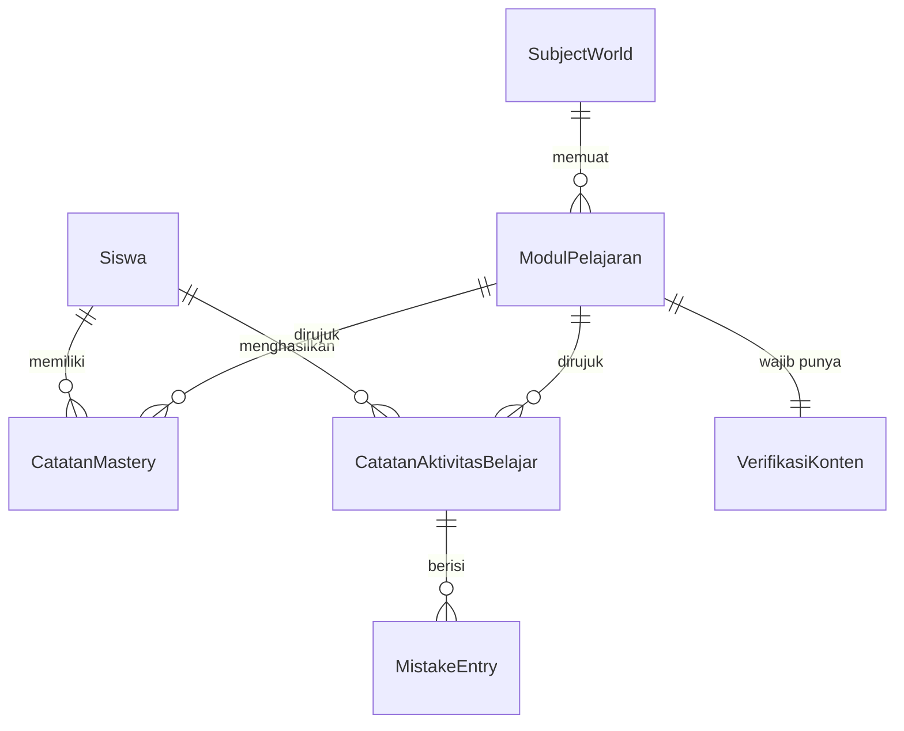

# Phase 1 Data Model: Lumera Core MVP

**Feature**: `001-core-mvp-prototype` | **Date**: 2026-07-29

Menurunkan Key Entities pada [spec.md](./spec.md) menjadi struktur data konkret. Seluruh entitas
tinggal di klien (`localStorage`) untuk prototype ini, tapi bentuknya sengaja dirancang agar bisa
dipindah ke backend tanpa perubahan bentuk (R-002).

---

## Entitas

### `Siswa`

Satu pengguna lokal. Prototype tidak punya autentikasi; satu perangkat = satu siswa.

| Field | Tipe | Aturan |
|---|---|---|
| `id` | string | dibuat sekali saat sesi pertama, tidak pernah berubah |
| `lumens` | integer | ≥ 0; hanya bertambah saat pelajaran selesai (FR-007) |
| `streakCount` | integer | ≥ 0 |
| `streakLastDate` | date (YYYY-MM-DD) | tanggal lokal terakhir siswa menyelesaikan ≥1 pelajaran |

**Relasi**: memiliki banyak `CatatanMastery`, banyak `CatatanAktivitasBelajar`.

**Transisi streak** (FR-008): saat pelajaran pertama selesai pada hari `T` —
`T == streakLastDate` → tidak berubah (sudah dihitung hari ini);
`T == streakLastDate + 1 hari` → `streakCount += 1`;
selisih > 1 hari, atau belum pernah ada → `streakCount = 1`.
`streakLastDate` selalu di-set ke `T`.

---

### `SubjectWorld`

Node pada Atlas. Data statis, tidak berubah saat runtime.

| Field | Tipe | Aturan |
|---|---|---|
| `id` | string | unik |
| `nama` | string | memakai terminologi produk resmi (FR-019) |
| `moduleIds` | string[] | modul yang tergantung pada node ini |
| `connections` | string[] | id subject world lain yang terhubung secara visual (FR-001) |

---

### `ModulPelajaran`

Definisi satu pelajaran. Statis; naskahnya tinggal di `content/` (R-006).

| Field | Tipe | Aturan |
|---|---|---|
| `id` | string | unik |
| `subjectWorldId` | string | harus merujuk `SubjectWorld` yang ada |
| `judul` | string | — |
| `konsepIds` | string[] | konsep yang diajarkan; dipakai sebagai `concept_id` pada event (FR-015) |
| `langkah` | LessonStepContent | konten untuk langkah 1, 5, 6 — lihat kontrak modul |
| `verifikasi` | VerifikasiKonten | **wajib terisi** sebelum rilis (FR-016, FR-020) |

**`VerifikasiKonten`** — inilah yang membuat SC-007 bisa dibuktikan, bukan diklaim:

| Field | Tipe | Aturan |
|---|---|---|
| `rujukanCP` | string | Capaian Pembelajaran Kurikulum Merdeka yang dirujuk |
| `reviewer` | string | **harus berbeda** dari penulis modul (gate konstitusi) |
| `tanggalVerifikasi` | date | — |

**Aturan validasi**: modul dengan `verifikasi` kosong atau `reviewer` sama dengan penulis MUST NOT
lolos FR-020, sehingga tidak dihitung ke dalam "minimal 4 modul" pada FR-003.

---

### `PercobaanInteraksi`

Satu aksi siswa pada langkah 3. Bersifat sementara (in-memory selama pelajaran berlangsung);
ringkasannya yang dipersistenkan lewat `CatatanAktivitasBelajar`.

| Field | Tipe | Aturan |
|---|---|---|
| `nomorPercobaan` | integer | mulai dari 1; bertambah tiap percobaan ulang |
| `benar` | boolean | — |
| `mistakeType` | string \| null | wajib terisi saat `benar == false` (FR-015) |
| `waktuMulai` / `waktuSelesai` | timestamp | selisihnya menyumbang durasi pengerjaan |

---

### `CatatanAktivitasBelajar`

Entitas inti Prinsip VI. Ditulis **saat pelajaran ditandai selesai**, tidak sebelumnya —
sejalan dengan FR-014 yang melarang pelajaran yang ditinggalkan dihitung.

| Field | Tipe | Aturan |
|---|---|---|
| `id` | string | unik |
| `siswaId` | string | — |
| `moduleId` | string | — |
| `conceptIds` | string[] | disalin dari modul; **tidak boleh kosong** |
| `mistakes` | MistakeEntry[] | boleh kosong (siswa benar di percobaan pertama) |
| `durasiMs` | integer | > 0; total waktu aktif pengerjaan |
| `selesaiPada` | timestamp | — |

**`MistakeEntry`**: `{ conceptId, mistakeType, nomorPercobaan }`.

**Aturan validasi** (menopang SC-006): catatan tanpa `conceptIds`, atau dengan `durasiMs` ≤ 0,
adalah cacat — ketiga data minimal Prinsip VI harus ada. Penulisan yang gagal MUST tercatat sebagai
error, bukan gagal diam-diam; kegagalan senyap di sinilah yang akan menghapus data historis secara
permanen.

---

### `CatatanMastery`

| Field | Tipe | Aturan |
|---|---|---|
| `siswaId` | string | — |
| `moduleId` | string | — |
| `masteryPersen` | integer | 0–100 |
| `diperbaruiPada` | timestamp | — |

**Aturan** (FR-009): mencerminkan **performa terbaru**, bukan akumulasi seumur hidup — siswa yang
membaik harus terlihat membaik. Rumus final ditetapkan di `tasks.md`; pendekatan yang disarankan
adalah rata-rata bergerak atas percobaan terakhir (R-007, titik terbuka).

---

## Diagram relasi

## Yang sengaja TIDAK dimodelkan

Menegaskan batas Out of Scope pada spec:

- **Kartu Knowledge Bank** — `CatatanAktivitasBelajar` adalah bahan mentahnya, bukan kartunya.
- **Jadwal spaced repetition** — tidak ada field interval/jatuh tempo di spec ini.
- **Akun keluarga / multi-siswa** — satu perangkat, satu `Siswa`.
